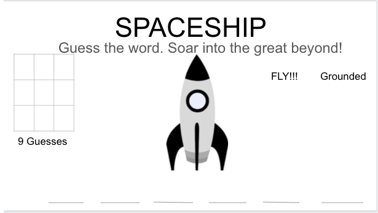

# SPACESHIP

## Description

My app is Spaceship. It's a two player game. A word is automatically generated. Players have to guess the word. The games score and results displayed at then end of each round.

## Planning Process

### User Stories

#### MVP

- As a user, I want randomly generated words so I don't have to come up with my own
- As a user, I need to see my correctly guessed letters and watch the word appear
- As a user, I would like to know when I win or lose
- As a user, I would like the image to appear as I guess the wrong letters
- As a user, I would like to see previously guessed letters

#### Bronze

#### Silver

#### Gold

- As a user, I would like game hints
- As a user, I would like the game to be scored
- As a user, multi-player would be nice to have. Also, the ability to play versus - the computer
- As a user, I want to be able to upload my own image as my token so I can customize the game

### Wireframes

#### Main View

#### About Modal
